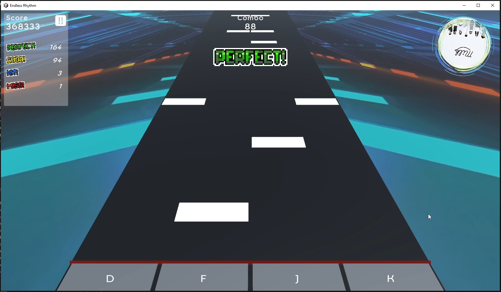
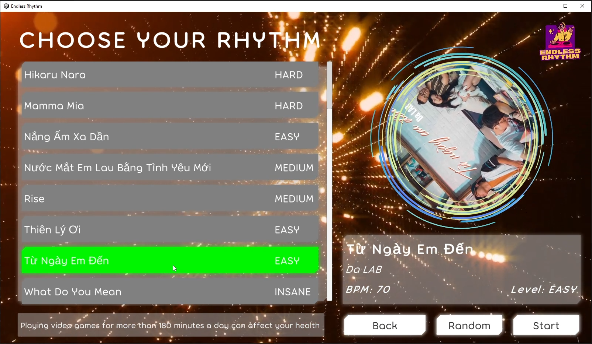
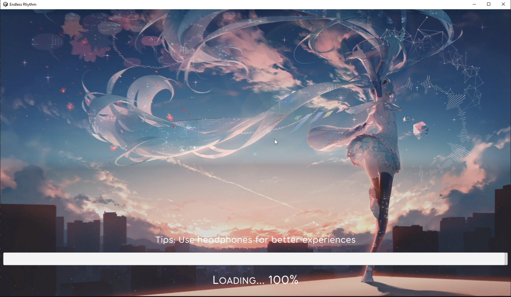
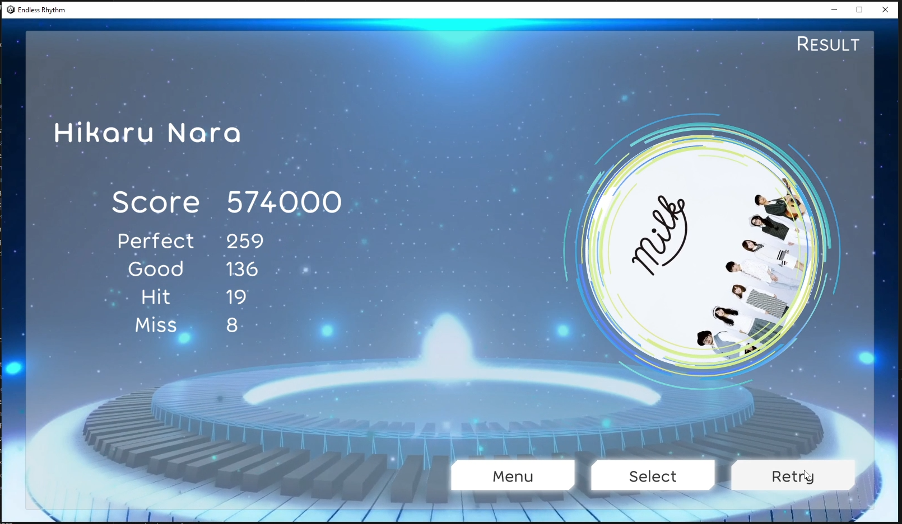
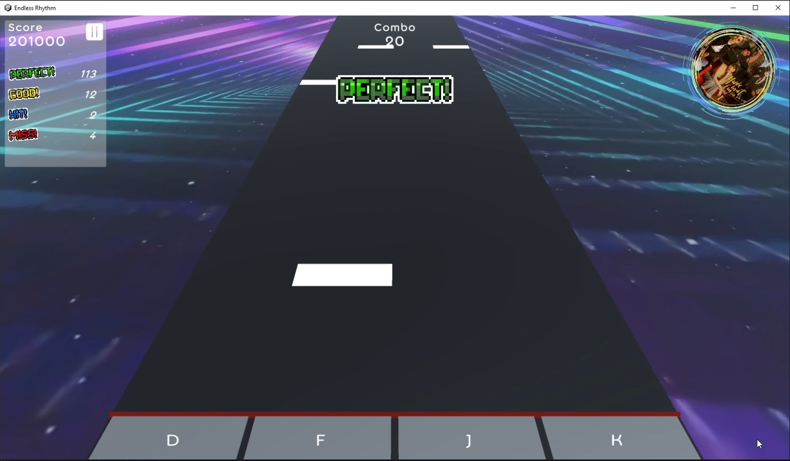

# ENDLESS RHYTHM

##### *4K Vertical Scrolling Rhythm Game*

Endless Rhythm là trò chơi âm nhạc nhịp điệu, với chế độ chơi đầu tiên là 4K VSRG (Vertical Scrolling Rhythm Game). Với những giai điệu hấp dẫn, những beatmaps đa dạng về độ khó sẽ đem đến trải nghiệm thú vị cho người chơi

### GIVE IT A TRY!

---

=>> Chơi thử/tải xuống (Windows PC): [EndlessRhythm_0.1](https://hiimjust.itch.io/endlessrhythm)

=>> Chơi thử/tải xuống (Android/iOS): TBA...

Với chế độ chơi 4K VSRG:

* Người chơi sử dụng 4 phím D, F, J, K để bắt trọn từng nốt nhạc tương ứng với từng khung nhạc.
* Bắt lấy nốt nhạc khi chúng trôi dần tới Judgement Line (đường đánh giá) - màu đỏ
* Tùy theo độ chính xác với từng nốt nhạc bắt được, người chơi được đánh giá với từng nốt tương ứng các mức độ khác nhau.
* Các nốt bắt trúng càng nhiều, đánh giá càng hoàn hảo => điểm người chơi càng cao.

Các bài hát có BPM (nhịp độ trên phút) khác nhau và Beatmaps có độ khó riêng. Hãy chọn cho mình giai điệu yêu thích, hoặc để định mệnh chọn ngẫu nhiên cho bạn.

Nhiều bài hát và các chế độ chơi khác sẽ dần dần được cập nhật trong thời gian tới.

### MÔI TRƯỜNG PHÁT TRIỂN

---

* Game Engine: Unity (2021.3.25f1 LTS)
* Ngôn ngữ: C#
* Thiết kế beatmap: [NoteEditor (Setchi)](https://github.com/setchi/NoteEditor)

### GAMEPLAY DEMO

---

1. [4K VSRG mode_Gameplay Demo_Endless Rhythm 0.1](https://drive.google.com/file/d/1lKBSsI72SAaMq4mEto8TuliefvePdu5h/view?usp=sharing)

### PHỤ LỤC

---

